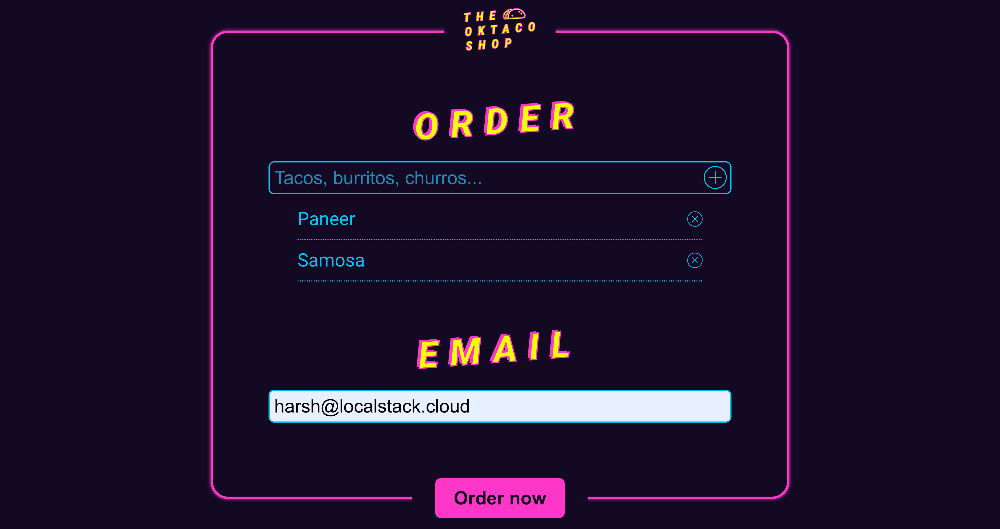
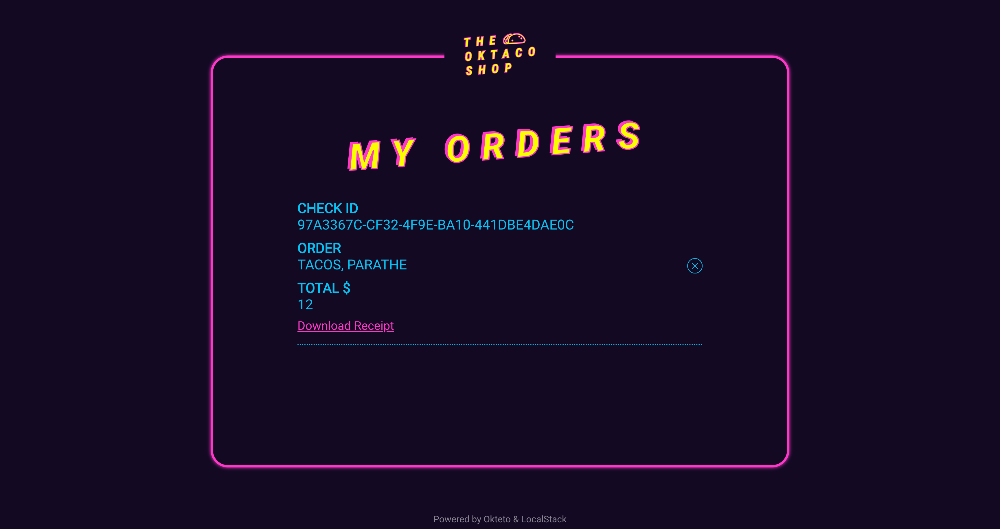
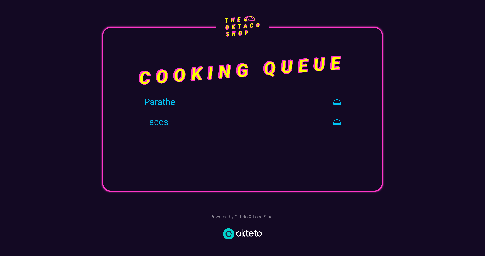

# Restaurant microservice with Okteto, Kubernetes, and AWS services with LocalStack

| Key          | Value                                                                                               |
| ------------ | --------------------------------------------------------------------------------------------------- |
| Environment  | LocalStack, Okteto                                                                                  |
| Services     | S3, SQS                                                                                             |
| Integrations | Kubernetes, Okteto                                                                                  |
| Categories   | Microservices                                                                                       |
| Level        | Basic                                                                                               |
| GitHub       | [Repository link](https://github.com/localstack-samples/sample-restaurant-microservices-sqs-okteto) |

## Introduction

This repository contains a sample restaurant microservices application that uses Okteto, Kubernetes, and AWS services with LocalStack. The application consists of three microservices:

- Menu microservice to place new orders at the restaurant.
- Kitchen microservice to manage the cooking queue at the restaurant.
- Check microservice to view the order and download the receipt.

The application provisions the required cloud infrastructure (S3 & SQS) using LocalStack, and the microservices are deployed on a Kubernetes cluster using Okteto.

## Architecture


## Prerequisites

- Okteto CLI 2.23 or newer
- An Okteto account ([Sign-up](https://www.okteto.com/try-free/) for 30 day, self-hosted free trial)

Once this is configured, anyone with access to your Okteto instance will be able to deploy an development environment automatically, including the required cloud infrastructure.

## Instructions

You can setup the development environment by cloning the repository and deploying the application using the following commands:

```bash
git clone https://github.com/okteto/external-resources-tf-localstack
cd external-resources-tf-localstack
okteto context use $OKTETO_URL
okteto deploy
```

Replace `$OKTETO_URL` with the URL of your Okteto instance. You will be able to access the application at the URL of your Okteto instance.

|  |  |  |
|:---:|:---:|:---:|
| *Menu microservice* | *Check microservice* | *Kitchen microservice* |

You can start developing on the Menu microservice by running the following command:

```bash
okteto up menu
```

You can similarly start developing on the Kitchen microservice by running the following command:

```bash
okteto up kitchen
```

To develop on the Result microservice, run the following command:

```bash
okteto up check
```

You can also setup preview environments for each of the microservices by using the [GitHub Action workflows](.github/workflows) provided in the repository. Refer to the [Okteto documentation](https://www.okteto.com/docs/preview/github/using-github-actions/) for more information on how to use Okteto for preview environments.
